## Portflolio

### About

Senior Mobile Apps Developer with 8+ years of experience. My career includes architecture & developement of app solutions for Corporates/Individual clients in Dubai, Spain and Pakistan.

Journey started as a mobile app developer from 2013. Android 2.2 was the gateway drug but it gave way to backend,fronend and its ecosystem.Loves trying out bleeding-edge technologies and spending every spare hour learning new stuff. 
  

<h4 align="center">
👨‍💻 Language/Framework stack
</h4>
 
 

👨‍💻 Java | Kotlin | PHP | Nodejs | Reactjs | ReactNative | Vuejs | Flutter

## [Dukkaani](https://play.google.com/store/apps/details?id=com.devicebee.dukani&hl=en)

Dukkaani is a pan Arab smart shopping platform transforming all shopping stores to sell their products online and we started in UAE as beginning, also it is the only application that provides all grocery items supported by clear images.

Groceries delivered to you in just a few clicks! No need to go out to the supermarket or local store. Access the app from anywhere, select a store, browse products and click to buy!

Buyer can have it delivered to any address-home, office or the park.

### My Role ###
My resposibilites included complete structural architecture and development of Android application and create a complete app and backend architecture based on requirements.  

### Technologies ###
Java | Firebase | Firebase Messaging  | CoreLocation  | SQLITE  | Facebook SDK |

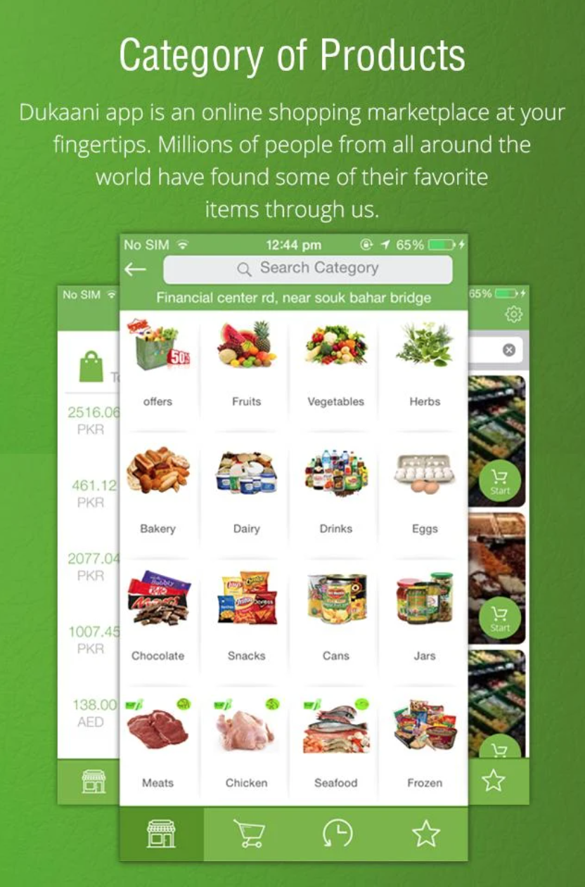&nbsp;&nbsp;
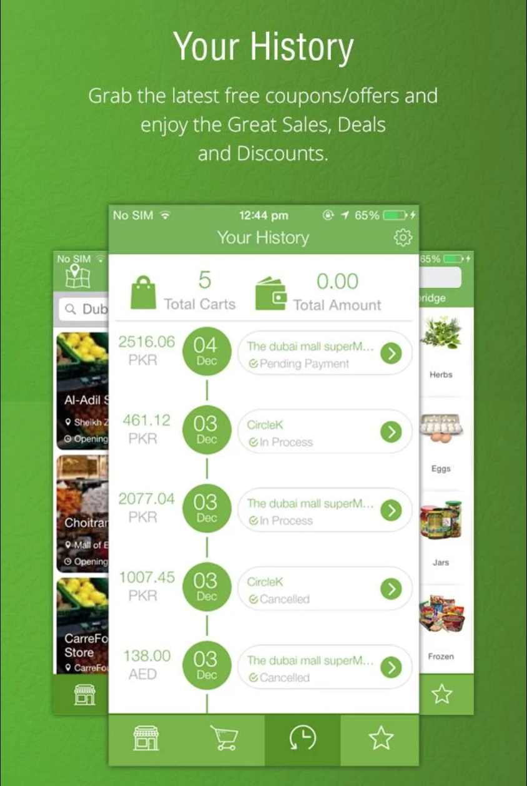&nbsp;&nbsp;
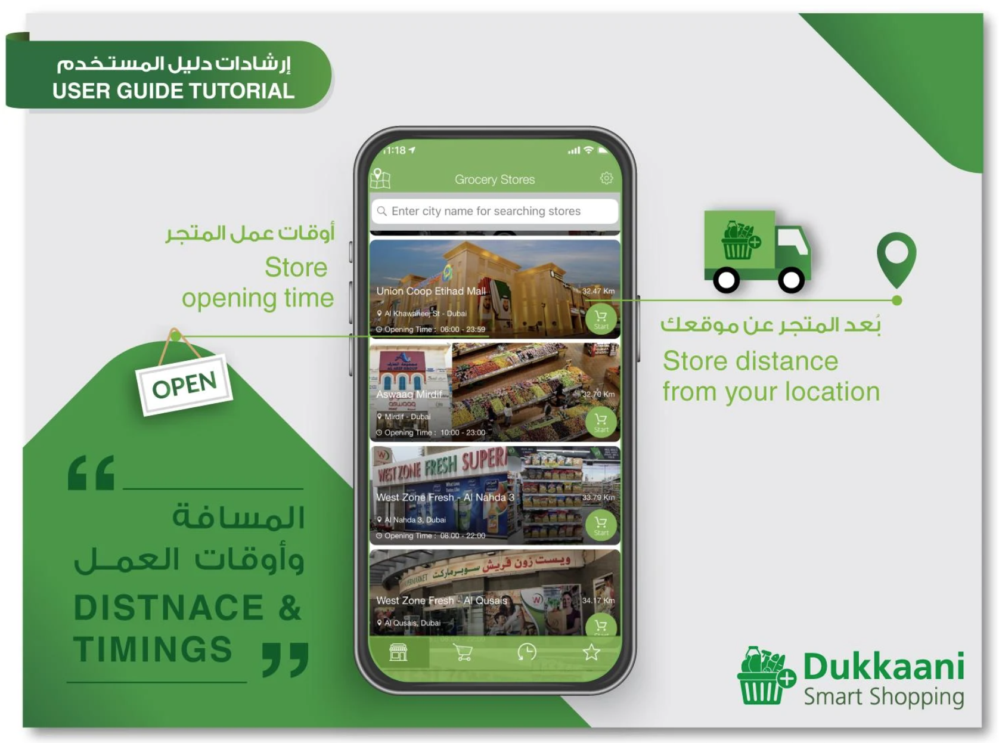&nbsp;&nbsp;

## [Cargo Cab](https://play.google.com/store/apps/details?id=com.devicebee.cargocab&hl=en_GB&gl=US)

Cargo Cab is a multi service app for fast, reliable instant services just in minutes—day or night.

There’s no need to look for a truck or search on line for towing car. With Cargo Cab, you just tap to request a service, and it’s easy to pay with credit or cash in select cities.

Whether you’re moving your business boxes or personal stuff in town or across town, there’s an instant service for you.

### My Role ###
Team Lead and android developer. The application uses event driver and socketio based architectural pattern as communication protocls. 

### Technologies ###
Java | Firebase | Google APIs | Retrofit | And-Camera | Picasso | Socketio | Google Maps

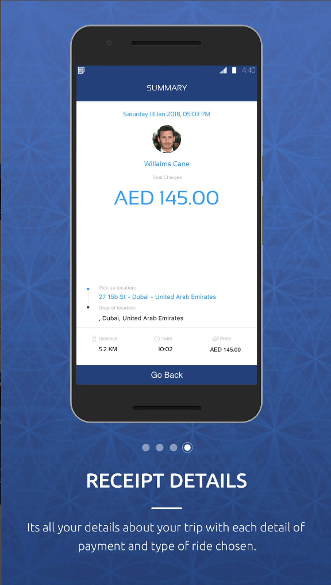
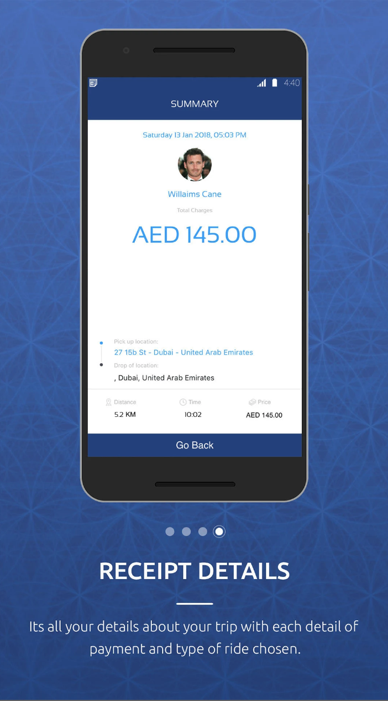
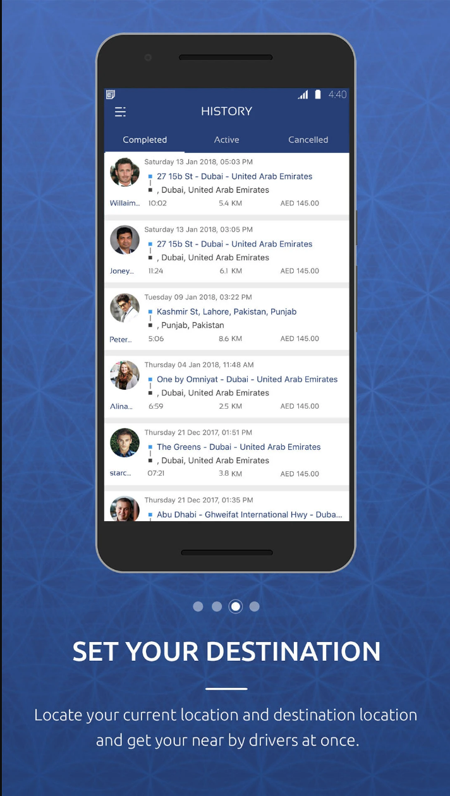
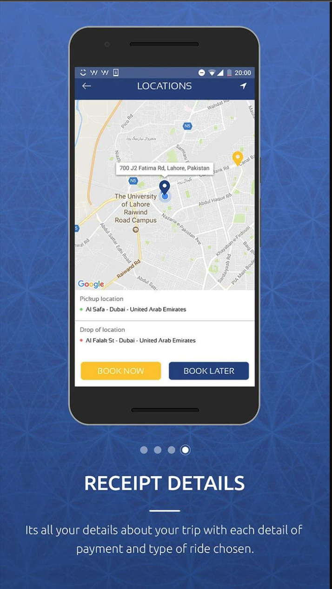

# [Recovery](https://play.google.com/store/apps/details?id=com.devicebee.recovery)

Recovery is an on demand application that allows the customers to immediately book a recovery service using the app within just few taps. You will never be stuck on the road again, Recovery covers the whole UAE. Recovery will tow your vehicle to your favorite garage, or  can recover your car so you are back on the road in no time. Flat tire? Out of fuel? stuck somewhere? battery died? No problem!

The application connects with the available service providers in the area according to user's set location.

### My Role ###
Team Lead and android developer. The application uses event driver and socketio based architectural pattern as communication protocls. 

### Technologies ###
Java | Firebase | Google APIs | Retrofit | And-Camera | Picasso | Socketio | Google Maps

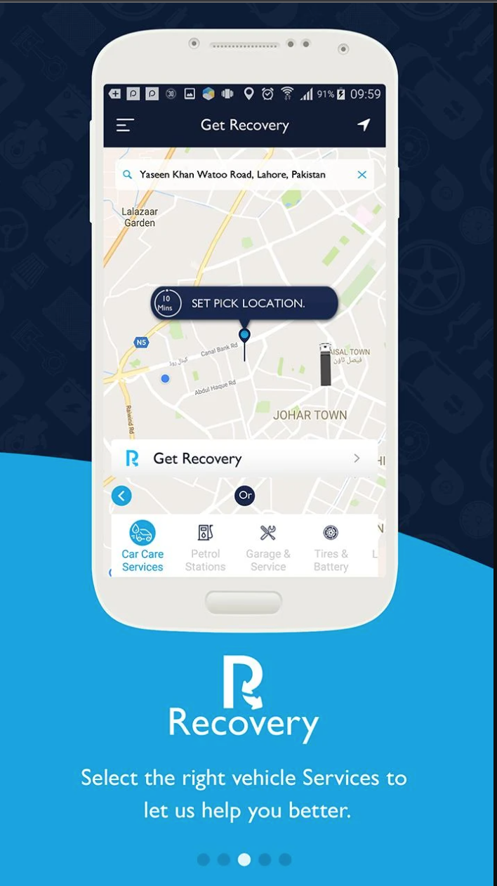
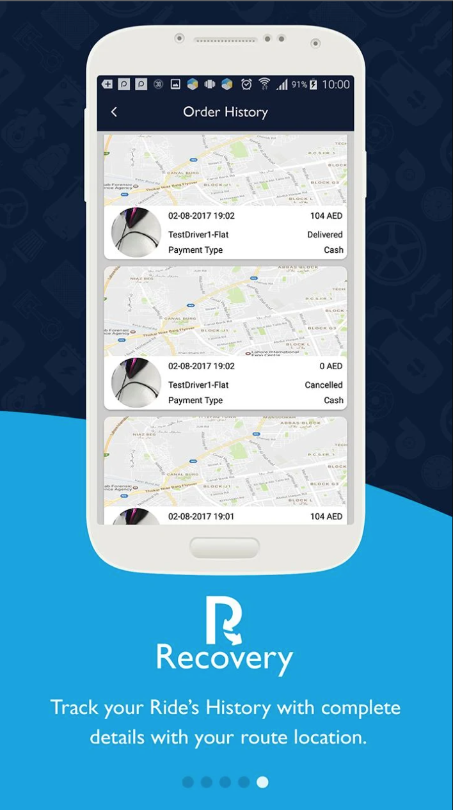
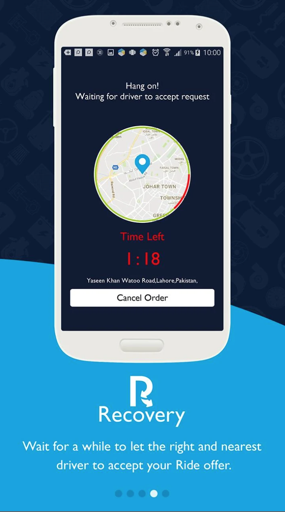
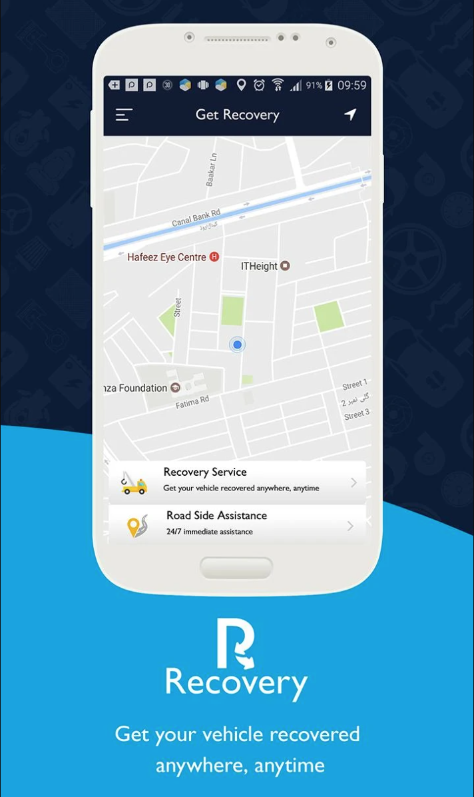

# [Facekart](https://play.google.com/store/apps/details?id=com.facekart.app&hl=en_GB&gl=US)

FaceKart is a Pakistan made app providing a wide range of services. We offer everyday essential services to our users. These essential services consist of Deliveries (food, groceries & medicens) & Services (Electricians, Plumbers, Carpenter, Rent a Car, Ac Technian & Doctors etc).

### My Role ###
Team Lead and android developer. The application uses event driver and socketio based architectural pattern as communication protocls. 

### Technologies ###
Java | Firebase | Google APIs | Retrofit | And-Camera | Picasso | Socketio | Google Maps

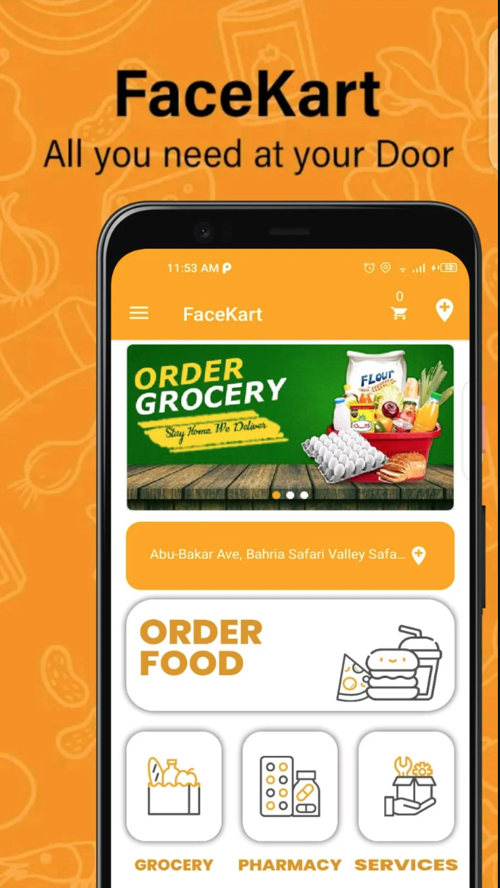
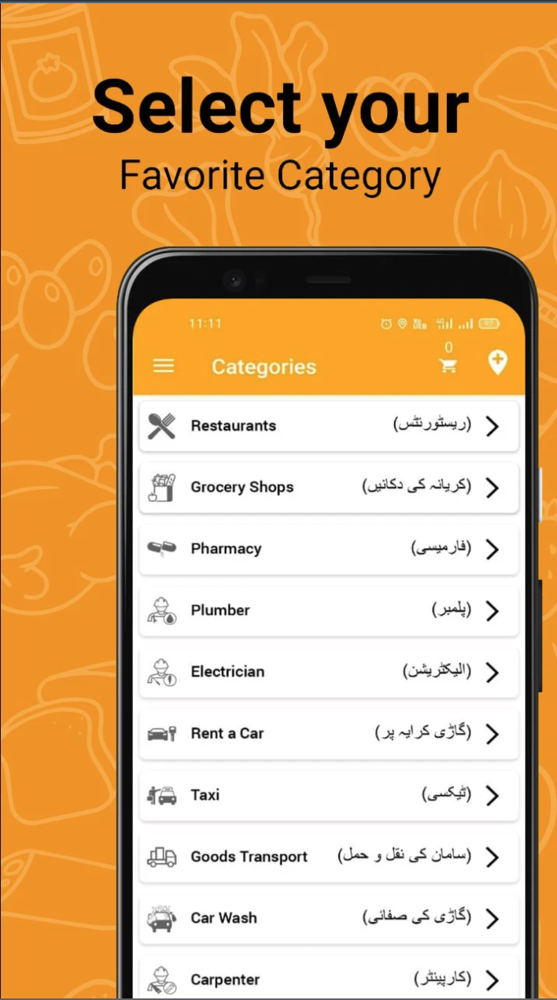
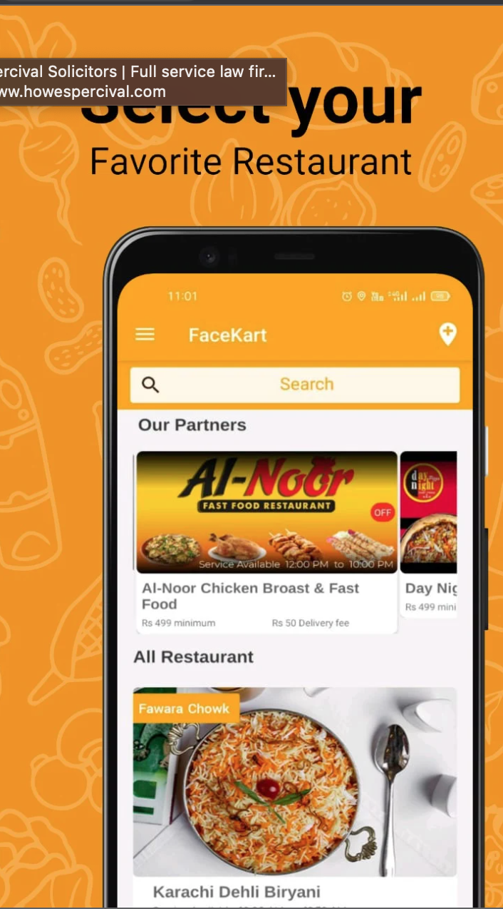
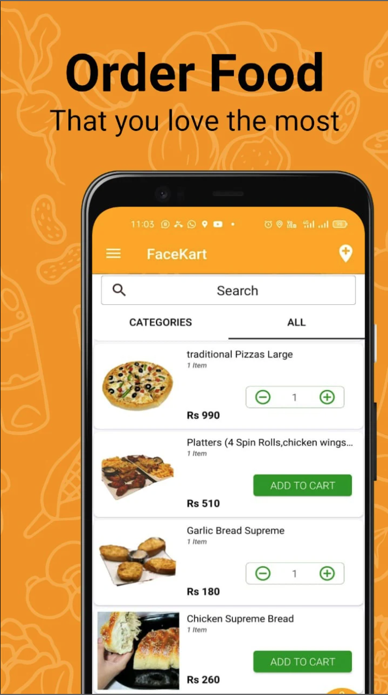

## 💻 Front-End

## [movileuros](https://recargas.movileuros.com/)

The Fastest Way to Send Mobile Top Up Internationally. Secure & Easy. Send Top Up Now! Send Mobile Recharge Online in Seconds with movileuros. Top Up Promos. Transparent Pricing. 550+ Operators. Stay Connected with F&F. Multiple Payment Options.

### My Role ###
Sole architect and solution developer.

### Technologies ###
Vuejs | Material UI Components | Thermal Printer plugin  | Firebase | Payment Gateways | Automation 

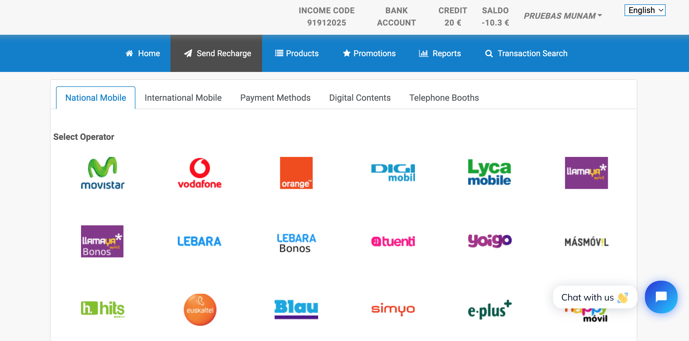

